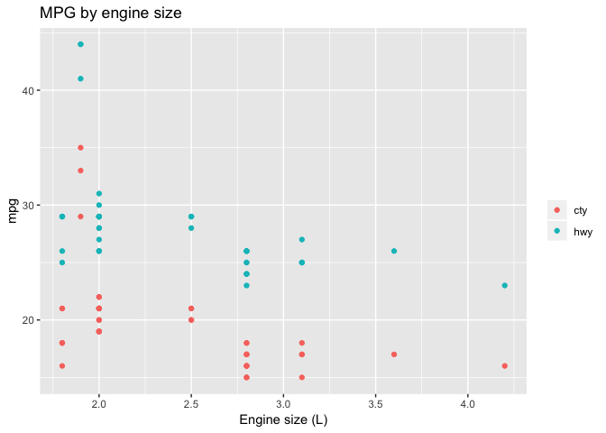
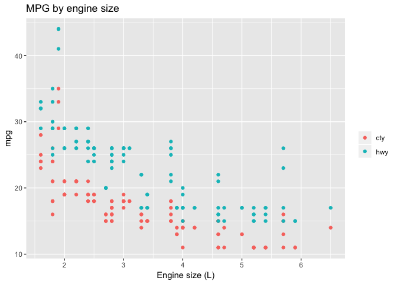
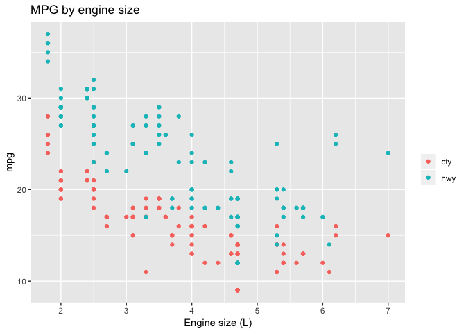
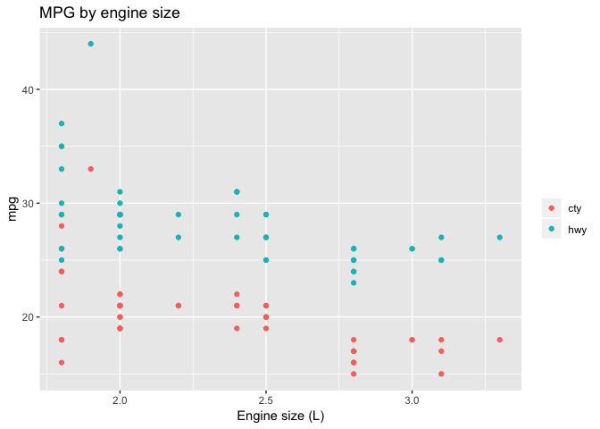
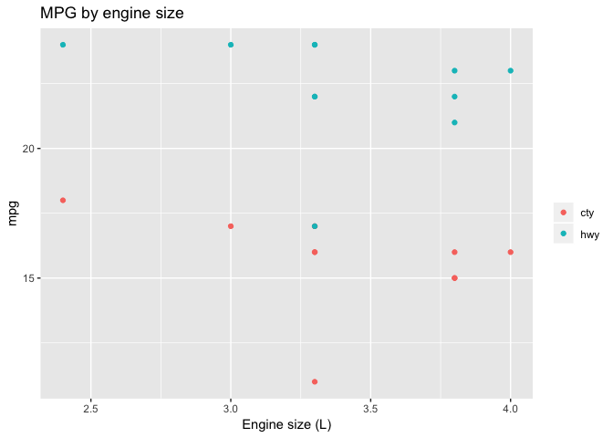

Tidy Subgroup Analysis
================
Ian Handel
21/01/2019

``` r
library(tidyverse)
```

    ## ── Attaching packages ────────────────────────────────────── tidyverse 1.2.1 ──

    ## ✔ ggplot2 3.1.0           ✔ purrr   0.2.5      
    ## ✔ tibble  2.0.99.9000     ✔ dplyr   0.7.8      
    ## ✔ tidyr   0.8.2           ✔ stringr 1.3.1      
    ## ✔ readr   1.3.1           ✔ forcats 0.3.0

    ## ── Conflicts ───────────────────────────────────────── tidyverse_conflicts() ──
    ## ✖ dplyr::filter() masks stats::filter()
    ## ✖ dplyr::lag()    masks stats::lag()

``` r
library(broom)
```

``` r
filters <- tibble(groups = c(
  quo(manufacturer %in% c("audi", "volkswagen")),
  quo(year == 1999),
  quo(year == 2008),
  quo(class == "compact"),
  quo(class == "minivan")
))
```

``` r
filter_mpg <- function(filter){
  filter(mpg, !!filter)
}
```

``` r
plot_mpg <- function(df){
  df %>% 
    gather(type, mpg, cty, hwy) %>% 
  ggplot() +
    aes(displ, mpg, colour = type) +
    geom_point() +
    labs(title = "MPG by engine size",
         x = "Engine size (L)",
         y = "mpg",
         colour = "")
}
```

``` r
result <- filters %>%
  mutate(filter = map_chr(groups, quo_name)) %>% 
  mutate(subdata = map(groups, filter_mpg)) %>%
  mutate(n = map_int(subdata, nrow)) %>% 
  mutate(plots = map(subdata, plot_mpg)) %>% 
  mutate(models = map(subdata, ~lm(cty ~ displ, data = .))) %>% 
  mutate(coef = map(models, tidy)) %>% 
  unnest(coef, .drop = FALSE) %>% 
  filter(term == "displ")
```

``` r
result %>%
  select(filter, n, term, estimate, std.error, p.value) %>%
  mutate_if(is_double, round, 3) %>% 
  gt::gt(groupname_col = vars(filter))
```

<!--html_preserve-->
<style>html {
  font-family: -apple-system, BlinkMacSystemFont, 'Segoe UI', Roboto, Oxygen, Ubuntu, Cantarell, 'Helvetica Neue', 'Fira Sans', 'Droid Sans', Arial, sans-serif;
}

#tswyizjlej .gt_table {
  display: table;
  border-collapse: collapse;
  margin-left: auto;
  margin-right: auto;
  color: #000000;
  font-size: 16px;
  background-color: #FFFFFF;
  /* table.background.color */
  width: auto;
  /* table.width */
  border-top-style: solid;
  /* table.border.top.style */
  border-top-width: 2px;
  /* table.border.top.width */
  border-top-color: #A8A8A8;
  /* table.border.top.color */
}

#tswyizjlej .gt_heading {
  background-color: #FFFFFF;
  /* heading.background.color */
  border-bottom-color: #FFFFFF;
}

#tswyizjlej .gt_title {
  color: #000000;
  font-size: 125%;
  /* heading.title.font.size */
  padding-top: 4px;
  /* heading.top.padding */
  padding-bottom: 1px;
  border-bottom-color: #FFFFFF;
  border-bottom-width: 0;
}

#tswyizjlej .gt_subtitle {
  color: #000000;
  font-size: 85%;
  /* heading.subtitle.font.size */
  padding-top: 1px;
  padding-bottom: 4px;
  /* heading.bottom.padding */
  border-top-color: #FFFFFF;
  border-top-width: 0;
}

#tswyizjlej .gt_bottom_border {
  border-bottom-style: solid;
  /* heading.border.bottom.style */
  border-bottom-width: 2px;
  /* heading.border.bottom.width */
  border-bottom-color: #A8A8A8;
  /* heading.border.bottom.color */
}

#tswyizjlej .gt_column_spanner {
  border-bottom-style: solid;
  border-bottom-width: 2px;
  border-bottom-color: #A8A8A8;
  padding-top: 4px;
  padding-bottom: 4px;
}

#tswyizjlej .gt_col_heading {
  color: #000000;
  background-color: #FFFFFF;
  /* column_labels.background.color */
  font-size: 16px;
  /* column_labels.font.size */
  font-weight: initial;
  /* column_labels.font.weight */
  vertical-align: middle;
  padding: 10px;
  margin: 10px;
}

#tswyizjlej .gt_sep_right {
  border-right: 5px solid #FFFFFF;
}

#tswyizjlej .gt_group_heading {
  padding: 8px;
  color: #000000;
  background-color: #FFFFFF;
  /* stub_group.background.color */
  font-size: 16px;
  /* stub_group.font.size */
  font-weight: initial;
  /* stub_group.font.weight */
  border-top-style: solid;
  /* stub_group.border.top.style */
  border-top-width: 2px;
  /* stub_group.border.top.width */
  border-top-color: #A8A8A8;
  /* stub_group.border.top.color */
  border-bottom-style: solid;
  /* stub_group.border.bottom.style */
  border-bottom-width: 2px;
  /* stub_group.border.bottom.width */
  border-bottom-color: #A8A8A8;
  /* stub_group.border.bottom.color */
  vertical-align: middle;
}

#tswyizjlej .gt_empty_group_heading {
  padding: 0.5px;
  color: #000000;
  background-color: #FFFFFF;
  /* stub_group.background.color */
  font-size: 16px;
  /* stub_group.font.size */
  font-weight: initial;
  /* stub_group.font.weight */
  border-top-style: solid;
  /* stub_group.border.top.style */
  border-top-width: 2px;
  /* stub_group.border.top.width */
  border-top-color: #A8A8A8;
  /* stub_group.border.top.color */
  border-bottom-style: solid;
  /* stub_group.border.bottom.style */
  border-bottom-width: 2px;
  /* stub_group.border.bottom.width */
  border-bottom-color: #A8A8A8;
  /* stub_group.border.bottom.color */
  vertical-align: middle;
}

#tswyizjlej .gt_striped {
  background-color: #f2f2f2;
}

#tswyizjlej .gt_row {
  padding: 10px;
  /* row.padding */
  margin: 10px;
  vertical-align: middle;
}

#tswyizjlej .gt_stub {
  border-right-style: solid;
  border-right-width: 2px;
  border-right-color: #A8A8A8;
  padding-left: 12px;
}

#tswyizjlej .gt_stub.gt_row {
  background-color: #FFFFFF;
}

#tswyizjlej .gt_summary_row {
  background-color: #FFFFFF;
  /* summary_row.background.color */
  padding: 6px;
  /* summary_row.padding */
  text-transform: inherit;
  /* summary_row.text_transform */
}

#tswyizjlej .gt_first_summary_row {
  border-top-style: solid;
  border-top-width: 2px;
  border-top-color: #A8A8A8;
}

#tswyizjlej .gt_table_body {
  border-top-style: solid;
  /* field.border.top.style */
  border-top-width: 2px;
  /* field.border.top.width */
  border-top-color: #A8A8A8;
  /* field.border.top.color */
  border-bottom-style: solid;
  /* field.border.bottom.style */
  border-bottom-width: 2px;
  /* field.border.bottom.width */
  border-bottom-color: #A8A8A8;
  /* field.border.bottom.color */
}

#tswyizjlej .gt_footnote {
  font-size: 90%;
  /* footnote.font.size */
  padding: 4px;
  /* footnote.padding */
}

#tswyizjlej .gt_sourcenote {
  font-size: 90%;
  /* sourcenote.font.size */
  padding: 4px;
  /* sourcenote.padding */
}

#tswyizjlej .gt_center {
  text-align: center;
}

#tswyizjlej .gt_left {
  text-align: left;
}

#tswyizjlej .gt_right {
  text-align: right;
  font-variant-numeric: tabular-nums;
}

#tswyizjlej .gt_font_normal {
  font-weight: normal;
}

#tswyizjlej .gt_font_bold {
  font-weight: bold;
}

#tswyizjlej .gt_font_italic {
  font-style: italic;
}

#tswyizjlej .gt_super {
  font-size: 65%;
}

#tswyizjlej .gt_footnote_glyph {
  font-style: italic;
  font-size: 65%;
}
</style>
<!--gt table start-->
<table class="gt_table">
<tr>
<th class="gt_col_heading gt_left" rowspan="1" colspan="1">
filter
</th>
<th class="gt_col_heading gt_right" rowspan="1" colspan="1">
n
</th>
<th class="gt_col_heading gt_left" rowspan="1" colspan="1">
term
</th>
<th class="gt_col_heading gt_right" rowspan="1" colspan="1">
estimate
</th>
<th class="gt_col_heading gt_right" rowspan="1" colspan="1">
std.error
</th>
<th class="gt_col_heading gt_right" rowspan="1" colspan="1">
p.value
</th>
</tr>
<tbody class="gt_table_body">
<tr>
<td class="gt_row gt_left">
manufacturer %in% c("audi", "volkswagen")
</td>
<td class="gt_row gt_right">
45
</td>
<td class="gt_row gt_left">
displ
</td>
<td class="gt_row gt_right">
-3.670
</td>
<td class="gt_row gt_right">
0.957
</td>
<td class="gt_row gt_right">
0.000
</td>
</tr>
<tr>
<td class="gt_row gt_left gt_striped">
year == 1999
</td>
<td class="gt_row gt_right gt_striped">
117
</td>
<td class="gt_row gt_left gt_striped">
displ
</td>
<td class="gt_row gt_right gt_striped">
-2.769
</td>
<td class="gt_row gt_right gt_striped">
0.205
</td>
<td class="gt_row gt_right gt_striped">
0.000
</td>
</tr>
<tr>
<td class="gt_row gt_left">
year == 2008
</td>
<td class="gt_row gt_right">
117
</td>
<td class="gt_row gt_left">
displ
</td>
<td class="gt_row gt_right">
-2.578
</td>
<td class="gt_row gt_right">
0.164
</td>
<td class="gt_row gt_right">
0.000
</td>
</tr>
<tr>
<td class="gt_row gt_left gt_striped">
class == "compact"
</td>
<td class="gt_row gt_right gt_striped">
47
</td>
<td class="gt_row gt_left gt_striped">
displ
</td>
<td class="gt_row gt_right gt_striped">
-4.480
</td>
<td class="gt_row gt_right gt_striped">
0.894
</td>
<td class="gt_row gt_right gt_striped">
0.000
</td>
</tr>
<tr>
<td class="gt_row gt_left">
class == "minivan"
</td>
<td class="gt_row gt_right">
11
</td>
<td class="gt_row gt_left">
displ
</td>
<td class="gt_row gt_right">
-1.424
</td>
<td class="gt_row gt_right">
1.264
</td>
<td class="gt_row gt_right">
0.289
</td>
</tr>
</tbody>
</table>
<!--gt table end-->

<!--/html_preserve-->
``` r
map(result$plots, print)
```



    ## [[1]]


    ## 
    ## [[2]]


    ## 
    ## [[3]]


    ## 
    ## [[4]]


    ## 
    ## [[5]]


